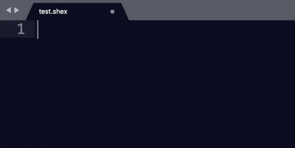
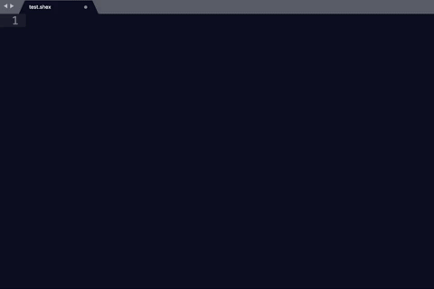

# Shex_Sublime_package

The (https://www.sublimetext.com/)[Sublime Text] editors support packages which are a collection of support files. This repository contains different packages to support writing shape expressions (ShEx) in Sublime text. 
 The basic feature of these packages is to support autocompletion. 
 
Either by providing templates (currently only available in the package supporting writing ShEx files
for validating content in Wikidata.) or resolving prefered labels to the prefix driven IRI's. 

## Installation 

### Download
The first step is to download the required packages. Currently, packages are available for:
* [Wikidata](./package/wikidata.sublime-package)
* [OBO](./package/obo.sublime-package)
* [Schema.org](./package/schema.sublime-package)

### Store in user package space
After downloading selected packages, they can be installed by saving them in one of the following folders: 

* <executable_path>/Packages/
* <data_path>/Installed Packages/

On an Apple computer the exact location where the user packages are stored can also be found by consulting the "Browse packages..." submenu in the preferences. (Can anyone tell how this is done on other platforms?)

Thats it, the packages are now ready to be used

## Use

The sublime packages work with scopes, which are the type files in which the different package features are available. 
In these package that scope is a ShEx file. To use these ShEx packages, the file first needs to be saved
with the extention .shex. 

### Term substitution
The main feature of these ShEx packages is substituting terms into the local name.
 Typing "SNP" will be substituted into "obo:SO_0000694"
  

### ShEx autocompletion
Currently this is only available in the ShEx package for writing shape expressions for Wikidata.
To facilitate writing shape expressions for Wikidata content currently two templates have been created
One for commonly used Wikidata prefixes and one for the shape of a Wikidata statement. Both 
can be selected by typing "wikidata" in a ShEx scoped sublime window. 
 
 

 

