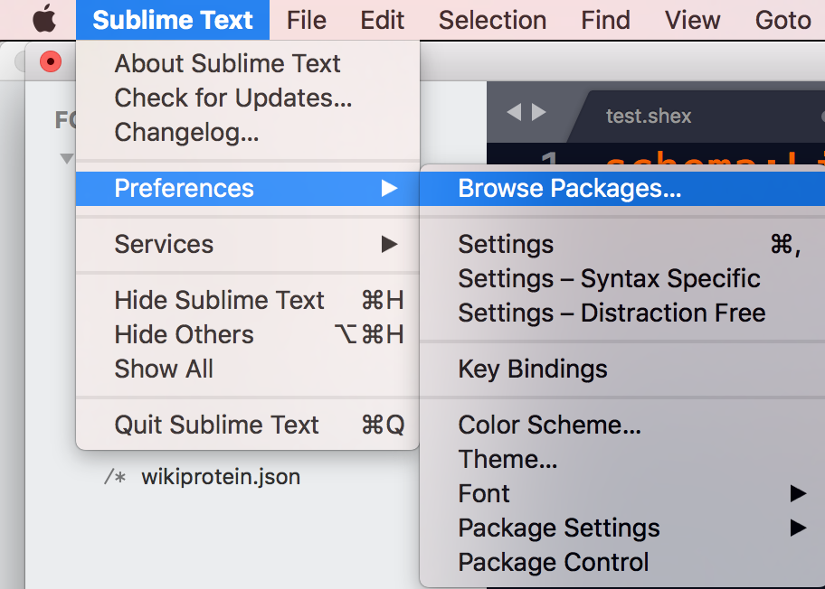

# Shex_Sublime_package

The (https://www.sublimetext.com/)[Sublime Text] editors support packages which are a collection of support files. This repository contains different packages to support writing shape expressions (ShEx) in Sublime text. 
 The basic feature of these packages is to support autocompletion. 
 
Either by providing templates (currently only available in the package supporting writing ShEx files
for validating content in Wikidata.) or resolving prefered labels to the prefix driven IRI's. 

## Installation 
After downloading the different packages, they can be installed by saving them in one of the following folders: 

* <executable_path>/Packages/
* <data_path>/Installed Packages/

On an Apple computer the exact location where the user packages are stored can also be found by consulting the "Browse packages..." submenu in the preferences. (Can anyone tell how this is done on other platforms?)

